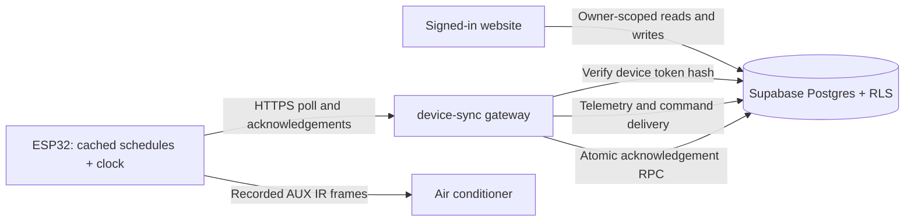

# Controller architecture

The current application uses a static website, Supabase Auth/Postgres, a device gateway, and autonomous ESP32 controllers. The old PHP/MySQL ZIP is a historical reference. It is not part of this runtime.



## Responsibilities and trust

- Browser: signs in with Supabase Auth, reads assigned devices, queues manual requests, and edits daily schedule windows. Its publishable key supplies no owner privileges without a user session. RLS checks ownership on each database operation.
- Database: stores configuration and requests, enforces schedule integrity, assigns server timestamps/deadlines, and records an acknowledgement and last IR report in one transaction. Owners cannot call the acknowledgement RPC; only the service role can.
- Gateway: authenticates each board with its unique token before accessing operational data. The privileged Supabase key stays here. The handler is separate from the server entry point so it can be exercised without starting an HTTP listener.
- ESP32: caches schedules, executes daily boundaries with a valid clock, sends manual IR commands, and remembers successful command IDs to avoid retransmitting them when an acknowledgement must be retried. It does not need an open browser to run schedules.

## Command lifetime

The database stamps a new command with a 60-second lifetime, overriding client-supplied creation or expiry timestamps. A device poll marks overdue queued commands failed and excludes them from delivery. The dashboard also displays an overdue command as expired before the board reconnects; the stored status is finalized on the next device poll.

The gateway returns the expiry epoch to firmware. Updated firmware checks its clock and deadline immediately before sending a new manual command. Previously sent command IDs can still retry their acknowledgement. A successful acknowledgement means IR was attempted successfully by the controller; physical AC state remains unknown.

Acknowledgements are scoped to both device and command ID. Repeating the same completed acknowledgement succeeds without rewriting timestamps or replaying the device state update. A contradictory status or unknown/cross-device ID is rejected. Failure during either database update rolls back both.

## Schedule integrity

Daily windows use Asia/Manila time. The database enforces minute precision, OFF after ON, no 24:00 endpoint, and no touching or overlapping enabled windows. A GiST exclusion constraint also protects against simultaneous conflicting writes. A transaction lock serializes capacity checks per device at the application's default READ COMMITTED isolation level. Each device can have at most 12 stored windows, matching firmware capacity. `updated_at` is stamped by the database.

Browser validation remains for immediate feedback. Database enforcement protects requests from other clients and concurrent browser sessions too.

## Rollout order

These improvements are prepared in the repository; they have not been applied to the hosted service.

1. Check existing enabled schedule windows for overlaps/touching boundaries, second precision, or 24:00 endpoints, and resolve them before migrating. Review any devices with more than 12 existing windows. No existing schedules are removed automatically.
2. Apply `supabase/migrations/20260926042142_command_and_schedule_integrity.sql`. Existing commands get a deadline derived from their original request time.
3. Deploy `supabase/functions/device-sync/` together, including `handler.ts`. The updated gateway depends on the new column and RPC.
4. Publish the updated `web/` assets for expiry/error labels.
5. Compile and upload the maintained ESP32 sketch for the last-moment deadline check. Older firmware remains compatible with the gateway but lacks the check for expiry in transit.

## Verification

`tests/test_architecture.mjs` runs real Postgres logic in an isolated PGlite database. Install the pinned runtime outside the repository and run:

```powershell
npm.cmd install --prefix "$env:TEMP/aircon-architecture-checks" --no-audit --no-fund @electric-sql/pglite@0.3.14
node tests/test_architecture.mjs "$env:TEMP/aircon-architecture-checks"
```

It checks owner isolation, RPC privileges, cross-device acknowledgements, retries, atomic rollback, server deadlines, schedule boundaries/precision, and capacity. It does not exercise concurrent connections.

The gateway tests use its real handler and Supabase HTTP client against a mocked backend:

```sh
deno test --allow-env tests/device_sync_test.ts
deno check supabase/functions/device-sync/index.ts
node --check web/app.js
arduino-cli compile --fqbn esp32:esp32:esp32 firmware/stage1_hardware_test
```

Use the ESP32 core and library versions recorded in README. The retired button test is not a check of current firmware.

Recorded checks on 2026-09-26: 22 isolated database assertions and four gateway tests passed; Deno type checking, browser JavaScript syntax checking, and diff whitespace checking passed. The hosted schedule preflight found no overlaps, invalid precision/midnight endpoints, or devices exceeding capacity. The local Arduino build was interrupted during its library compilation passes, so a complete firmware build remains unverified. That machine had ESP32 core 3.3.11 and IRremoteESP8266 2.9.0; the existing CI pins core 2.0.17 and IRremoteESP8266 2.8.6. No hardware was flashed.

## Remaining work

Physical IR response, sensor telemetry and schedule execution need hardware observation. There is no measured energy usage or verified AC power state. Local schedules currently execute at matching minute boundaries; catching missed boundaries after reboot, clock corrections or long blocking operations requires a separately defined reconciliation rule. Telemetry stores the latest reading rather than a history. Fleet token rotation, firmware updates, and audit/retention policy remain future work.

The hosted security advisor also reports leaked-password protection disabled. Its two policy-free tables (`device_tokens` and `private.allowed_owners`) intentionally deny browser access; do not add public policies to silence those informational notices. See [Supabase password protection](https://supabase.com/docs/guides/auth/password-security#password-strength-and-leaked-password-protection).

Database function privileges follow [Supabase's database function guidance](https://supabase.com/docs/guides/database/functions); schedule enforcement uses [Postgres exclusion constraints](https://www.postgresql.org/docs/current/ddl-constraints.html).
# Admin role management (2026-09-26)

Settings → Invite and manage users now lists admins and provides promotion and
demotion. `admin_set_user_role` checks the caller against the private admin
allowlist, requires a confirmed approved account for promotion, and serializes
changes to prevent removal of the last confirmed admin. Admins use the existing
fleet access policies; demoted accounts retain their previous device and weekly
room assignments. Role changes are read from the database on each refresh.

The migration was applied through Supabase MCP because CLI dry-run found remote
migration versions missing locally (20260926075132, 20260926075145,
20260926121057). Reconcile those migration files before the next CLI push; do not
mark existing remote migrations reverted just to bypass that mismatch.

Verified promotion, demotion, all-device access, rejection of unauthenticated
requests and self-promotion, and last-admin protection in rolled-back database
transactions. Published to inuvair.tech and confirmed the served script includes
the new RPC. The signed-in browser flow has not been exercised.
